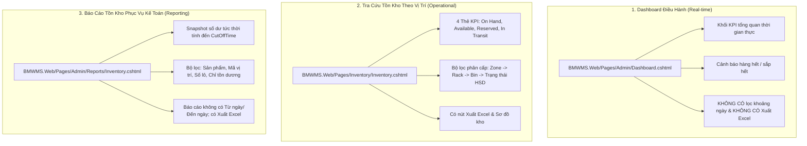

# BÁO CÁO ĐỐI SOÁT PHÂN HỆ 10 & 12: TỒN KHO THEO VỊ TRÍ & BÁO CÁO (REPORTS)
**Phạm vi Use Case:** UC-063 đến UC-067 (Inventory) và UC-078 đến UC-091 (Dashboard & Reports)  
**Vị trí trong tài liệu SRS:** Mục 2.10 (Inventory) và Mục 2.12 (Dashboard and Reports)  
**Trạng thái đối soát:** **Lệch pha nghiêm trọng 90% do toàn bộ use case bị copy nhầm Source Wireframe và bảng lọc trường của Dashboard.**

---

## 1. BẢNG TỔNG HỢP TRẠNG THÁI TỪNG USE CASE

| Mã UC | Tên Use Case | Source trong SRS | Source thực tế trong Code | Đánh giá & Hướng xử lý |
| :---: | :--- | :--- | :--- | :--- |
| **UC-063** | View inventory dashboard | `Inventory/Index.cshtml` | `BMWMS.Web/Pages/Inventory/Inventory.cshtml` | ❌ Trỏ nhầm trang rỗng redirect |
| **UC-064** | Search inventory | `Inventory/Index.cshtml` | `BMWMS.Web/Pages/Inventory/Inventory.cshtml` | ❌ Trỏ nhầm trang rỗng redirect |
| **UC-065** | View inventory by location | `Inventory/Index.cshtml` | `BMWMS.Web/Pages/Inventory/Inventory.cshtml` | ❌ **Trỏ nhầm trang rỗng redirect** |
| **UC-066** | View inventory by lot/expiry | `Inventory/Index.cshtml` | `BMWMS.Web/Pages/Inventory/Inventory.cshtml` | ❌ Trỏ nhầm trang rỗng redirect |
| **UC-067** | View inventory transaction history | `Inventory/Index.cshtml` | `BMWMS.Web/Pages/Inventory/Inventory.cshtml` | ❌ Trỏ nhầm trang rỗng redirect |
| **UC-078** | View general dashboard | `Admin/Dashboard.cshtml` | `BMWMS.Web/Pages/Admin/Dashboard.cshtml` | ❌ Sai bản chất (Bỏ lọc ngày/Excel) |
| **UC-079** | View inventory dashboard | `Admin/Dashboard.cshtml` | `BMWMS.Web/Pages/Admin/Dashboard.cshtml` | ❌ Sai bản chất (Bỏ lọc ngày/Excel) |
| **UC-080** | Inventory report | `Admin/Dashboard.cshtml` | `BMWMS.Web/Pages/Admin/Reports/Inventory.cshtml` | ❌ **Sai Source & Bộ lọc (Snapshot)** |
| **UC-081** | Inbound report | `Admin/Dashboard.cshtml` | `BMWMS.Web/Pages/Admin/Reports/Inbound.cshtml` | ❌ Sai Source Wireframe |
| **UC-082** | Outbound report | `Admin/Dashboard.cshtml` | `BMWMS.Web/Pages/Admin/Reports/Outbound.cshtml` | ❌ Sai Source Wireframe |
| **UC-083** | Inbound-outbound-stock report | `Admin/Dashboard.cshtml` | `BMWMS.Web/Pages/Admin/Reports/InOutStock.cshtml` | ❌ Sai Source Wireframe |
| **UC-084** | Product statistics | `Admin/Dashboard.cshtml` | *KHÔNG CÓ TRONG CODE* | ❌ Không tồn tại Controller/View |
| **UC-085** | Supplier statistics | `Admin/Dashboard.cshtml` | `BMWMS.Web/Pages/Admin/Reports/SupplierStatistics.cshtml`| ❌ Sai Source Wireframe |
| **UC-086** | Stocktake statistics | `Admin/Dashboard.cshtml` | *KHÔNG CÓ TRONG CODE* | ❌ Không tồn tại Controller/View |
| **UC-087** | Warehouse KPI report | `Admin/Dashboard.cshtml` | *KHÔNG CÓ TRONG CODE* | ❌ Không tồn tại Controller/View |
| **UC-088** | Low-stock alert | `Admin/Dashboard.cshtml` | `BMWMS.Web/Pages/Admin/Reports/LowStock.cshtml` | ❌ Sai Source Wireframe |
| **UC-089** | Expiring-lot alert | `Admin/Dashboard.cshtml` | `BMWMS.Web/Pages/Admin/Reports/ExpiringLot.cshtml` | ❌ Sai Source Wireframe |
| **UC-090** | Overdue-order alert | `Admin/Dashboard.cshtml` | *KHÔNG CÓ TRONG CODE* | ❌ Không tồn tại Controller/View |
| **UC-091** | Export report to Excel | `Admin/Dashboard.cshtml` | Nút Xuất Excel trên từng trang báo cáo riêng | ⚠️ Tích hợp trên từng báo cáo |

---

## 2. PHÂN BIỆT RÕ 3 LOẠI MÀN HÌNH TỒN KHO TRONG HỆ THỐNG

Một trong những nhầm lẫn lớn nhất của người soạn SRS là đánh đồng Dashboard, Tra cứu tồn kho theo vị trí và Báo cáo tồn kho. Trong mã nguồn BMWMS, 3 màn hình này hoàn toàn khác nhau:



---

## 3. CHI TIẾT TỪNG USE CASE VÀ HƯỚNG DẪN ĐIỀU CHỈNH

### Nhóm Tra cứu tồn kho (UC-063 đến UC-067)
* **Lỗi trong SRS:** Cả 5 use case đều ghi Source là `BMWMS.Web/Pages/Inventory/Index.cshtml` và chép bảng lọc: *Từ khóa, Kho, Vị trí lưu trữ, Trạng thái*.
* **Code thực tế:**
  * File [`BMWMS.Web/Pages/Inventory/Index.cshtml.cs`](file:///c:/bmwms/BMWMS.Web/Pages/Inventory/Index.cshtml.cs) dòng 21:
    ```csharp
    public IActionResult OnGet()
    {
        return RedirectToPage("/Inventory/Inventory");
    }
    ```
    Trang này chỉ là một Redirect stub rỗng!
  * Màn hình tra cứu tồn kho thực tế của hệ thống là **[`BMWMS.Web/Pages/Inventory/Inventory.cshtml`](file:///c:/bmwms/BMWMS.Web/Pages/Inventory/Inventory.cshtml)** (*Tồn Kho Theo Kho & Vị Trí*):
    * **4 Thẻ thống kê tổng quan:**
      * *Tồn thực tế (On Hand):* Tổng hàng đang có trong kho.
      * *Khả dụng (Available):* Số lượng sẵn sàng xuất bán (`OnHand - Reserved`).
      * *Giữ chỗ (Reserved):* Số lượng đã được khóa cho các đơn bán hàng (`SalesOrder`).
      * *Đang chuyển (In Transit):* Số lượng đang trong quá trình chuyển kho.
    * **Bộ lọc phân cấp vị trí chuẩn:**
      * *Từ khóa (`Filter.Keyword`):* Tìm theo mã hoặc tên sản phẩm.
      * *Khu vực (`Filter.ZoneId`):* Dropdown Zone.
      * *Dãy/Kệ (`Filter.RackId`):* Dropdown Rack.
      * *Vị trí chi tiết (`Filter.StorageLocationId`):* Dropdown Bin.
      * *Trạng thái hàng hóa (`Filter.Status`):* Tất cả, Bình thường, Cận hạn, Đã hết hạn.
    * **Cột hiển thị:** Sản phẩm (SKU, Tên), ĐVT, Vị trí (LocationCode kèm Rack/Zone), Lô & HSD, On Hand, Reserved, Available, In Transit, Badge Trạng thái.
    * **Thao tác:** Nút *Xuất Excel* (`ExportExcel`) và Nút *Sơ đồ vị trí kho* (dẫn tới `/StorageLocations/Index`).
* **Cần sửa trong SRS:** Đổi Source sang `BMWMS.Web/Pages/Inventory/Inventory.cshtml` và cập nhật đúng các trường lọc phân cấp và 4 metric cards.

---

### UC-078 & UC-079: General Dashboard & Inventory Dashboard
* **Lỗi trong SRS:** Ghi có các trường lọc *Từ ngày, Đến ngày, Trạng thái/Loại chứng từ, Xuất Excel*.
* **Code thực tế:** Màn hình [`BMWMS.Web/Pages/Admin/Dashboard.cshtml`](file:///c:/bmwms/BMWMS.Web/Pages/Admin/Dashboard.cshtml) là Dashboard tức thời, **hoàn toàn không có bộ lọc ngày tháng hay xuất file Excel**.
* **Cần sửa trong SRS:** Xóa bỏ bộ lọc ngày tháng và nút Xuất Excel; mô tả đúng các khối KPI và cảnh báo tức thời.

---

### UC-080: Inventory report (Báo cáo tồn kho)
* **Lỗi trong SRS:**
  * Source ghi nhầm là: `BMWMS.Web/Pages/Admin/Dashboard.cshtml`.
  * Field Description ghi có: *Từ ngày, Đến ngày, Trạng thái / Loại chứng từ, Xuất Excel*.
* **Code thực tế:**
  * Giao diện: [`BMWMS.Web/Pages/Admin/Reports/Inventory.cshtml`](file:///c:/bmwms/BMWMS.Web/Pages/Admin/Reports/Inventory.cshtml).
  * API: [`ReportsController.cs`](file:///c:/bmwms/BMWMS.API/Controllers/ReportsController.cs) (`GET api/Reports/inventory` và `GET api/Reports/inventory/export`).
  * **ĐẶC TÍNH NGHIỆP VỤ QUAN TRỌNG:** Báo cáo tồn kho là **Báo cáo Snapshot tại thời điểm cut-off hiện tại ("Dữ liệu tính đến: CutOffTime")**. Báo cáo này **KHÔNG LỌC THEO KHOẢNG NGÀY (Từ ngày / Đến ngày)** vì đây là số dư tức thời, không phải số biến động.
  * Bộ lọc thực tế:
    * *Sản phẩm (`ProductSearch`):* Mã hoặc tên sản phẩm.
    * *Vị trí kho (`LocationCode`):* Mã vị trí ô Bin.
    * *Số lô (`LotNumber`):* Lọc theo số lô.
    * *Chỉ tồn dương (`PositiveStockOnly`):* Checkbox chỉ hiển thị hàng có tồn > 0.
    * *Hiển thị (`PageSize`):* 10, 20, 50, 100 dòng.
    * *Nút Xuất Excel:* Tải file `InventoryReport.xlsx`.
  * Bảng dữ liệu hiển thị theo vị trí & lô:
    * *Sản phẩm:* Mã SKU, Tên hàng hóa.
    * *Chi tiết:* Vị trí kho (`LocationCode`), Số lô (`LotNumber`), Đơn vị tính (`UnitCode`).
    * *Hạn sử dụng (`ExpiryDate`).*
    * *Tồn kho (`OnHandQuantity`), Giữ chỗ (`ReservedQuantity`), Khả dụng (`AvailableQuantity`).*
* **Cần sửa trong SRS:**
  * Đổi Source Wireframe sang: `BMWMS.Web/Pages/Admin/Reports/Inventory.cshtml`.
  * Bỏ hoàn toàn các trường "Từ ngày", "Đến ngày", "Loại chứng từ"; thay thế bằng: Sản phẩm, Vị trí kho, Số lô, Chỉ tồn dương, Số dòng/trang.

---

### Các báo cáo nghiệp vụ khác (UC-081 đến UC-089)
1. **UC-081 (Inbound report) & UC-082 (Outbound report):**
   * Đổi Source sang [`BMWMS.Web/Pages/Admin/Reports/Inbound.cshtml`](file:///c:/bmwms/BMWMS.Web/Pages/Admin/Reports/Inbound.cshtml) và [`Outbound.cshtml`](file:///c:/bmwms/BMWMS.Web/Pages/Admin/Reports/Outbound.cshtml).
2. **UC-083 (Inbound-outbound-stock report - Báo cáo xuất nhập tồn):**
   * Đổi Source sang [`BMWMS.Web/Pages/Admin/Reports/InOutStock.cshtml`](file:///c:/bmwms/BMWMS.Web/Pages/Admin/Reports/InOutStock.cshtml). Báo cáo này mới có lọc theo khoảng thời gian: *Từ ngày (`FromDate`), Đến ngày (`ToDate`), Sản phẩm, Nhóm sản phẩm*.
3. **UC-085 (Supplier statistics):** Đổi Source sang [`BMWMS.Web/Pages/Admin/Reports/SupplierStatistics.cshtml`](file:///c:/bmwms/BMWMS.Web/Pages/Admin/Reports/SupplierStatistics.cshtml).
4. **UC-088 (Low-stock alert) & UC-089 (Expiring-lot alert):**
   * Đổi Source sang [`BMWMS.Web/Pages/Admin/Reports/LowStock.cshtml`](file:///c:/bmwms/BMWMS.Web/Pages/Admin/Reports/LowStock.cshtml) và [`ExpiringLot.cshtml`](file:///c:/bmwms/BMWMS.Web/Pages/Admin/Reports/ExpiringLot.cshtml).
5. **Bốn Use Case KHÔNG TỒN TẠI TRONG CODE:**
   * **UC-084 (Product statistics)**
   * **UC-086 (Stocktake statistics)**
   * **UC-087 (Warehouse KPI report)**
   * **UC-090 (Overdue-order alert)**
   * Trong code không có bất kỳ Controller hay View nào cho 4 báo cáo này. Cần loại bỏ khỏi tài liệu SRS Code-based hoặc chuyển vào phụ lục "Các tính năng dự kiến phát triển ở Phase tiếp theo".
